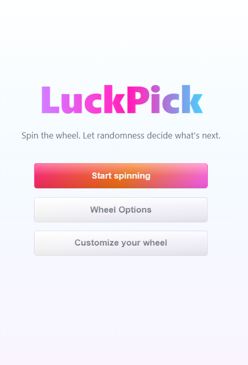
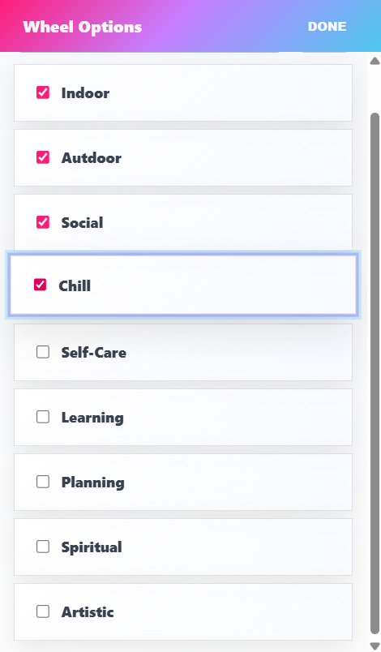
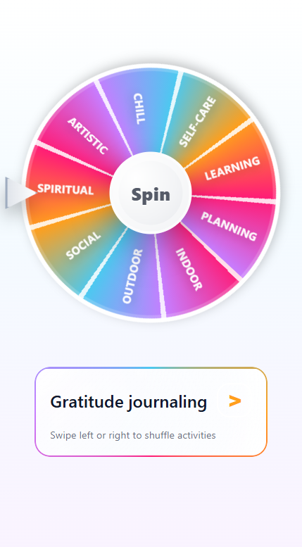
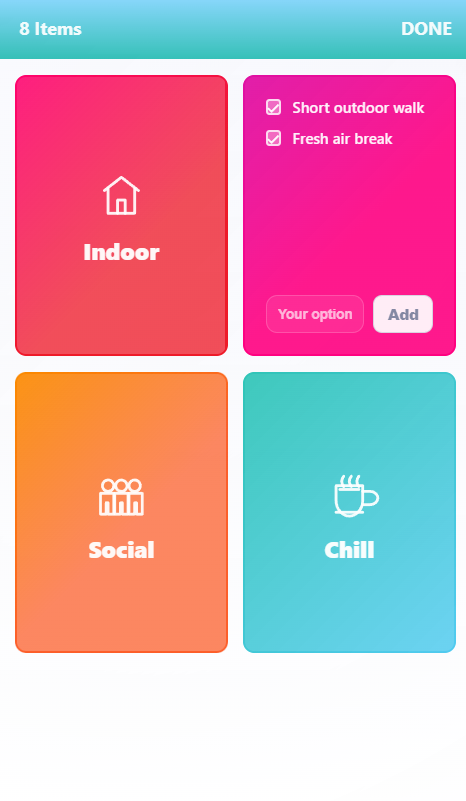

## LuckPick

Spin your day. Choose your adventure.

LuckPick is a fun, interactive **React + TypeScript** app that helps you decide what to do next. Spin a colorful wheel, get a concrete activity for the category you land on, and shuffle through more ideas with a tap or a swipe. Tune which categories appear on the wheel and customize sub-options anytime.

---

## Features

- **Landing**: Start spinning, open **Wheel Options**, or open **Customize your wheel**.
- **Interactive wheel**: Tap **Spin** on the center hub; smooth spin animation and segment labels.
- **Wheel Options screen**: Check which categories are on the wheel and add new wheel options.
- **Customize your wheel**: Full-screen flip cards per category—sub-options with checkboxes and “Your option” + **Add**.
- **Activity card**: Shows the picked activity; use **>** or **swipe** left/right to cycle activities (loops through the list).
- **Frontend only**: No backend; state lives in React Context (`LuckPickContext`).

---

## Screenshots

### Landing



### Wheel options



### Spin wheel



### Customize wheel



_All images are stored in [`screenshots/ui-reference/`](screenshots/ui-reference/)._

---

## Tech Stack

- **Build**: [Vite](https://vitejs.dev/) 7
- **UI**: React 19, TypeScript, CSS
- **State**: React Context API (`LuckPickContext`)

---

## Getting Started

1. **Install dependencies**

   ```bash
   npm install
   ```

2. **Run the dev server**

   ```bash
   npm run dev
   ```

3. **Open the app**  
   Use the URL from the terminal (usually `http://localhost:5173`).

### Other scripts

| Command        | Description              |
| -------------- | ------------------------ |
| `npm run build` | Typecheck + production build to `dist/` |
| `npm run preview` | Preview the production build locally |
| `npm run lint`  | Run ESLint               |
| `npm run deploy` | Deploy `dist/` via `gh-pages` (after `predeploy` build) |

---

## How to Use

1. On the **landing** screen, tap **Start spinning** to open the main wheel view.
2. **Spin**: Tap the **Spin** label in the wheel center (not a separate bar below).
3. Read the **activity** under the wheel; tap **>** or swipe on the card for the next idea in that category.
4. From the landing screen (before you start), use **Wheel Options** to include/exclude categories or add new ones, and **Customize your wheel** to edit sub-activities per category.

---

## Folder Structure (simplified)

```text
luckpick/
  public/
  screenshots/
    ui-reference/          # README / design reference images
  src/
    components/
      Wheel/
      ActivityCard/
      CustomizeWheelMenu/
      WheelOptionsScreen/
      Landing.tsx
      Header.tsx
      Footer.tsx
      CustomWheelEditor/   # present in repo; not wired in main App flow
      History/             # present in repo; not shown in main App flow
    context/
      LuckPickContext.tsx
    App.tsx
    main.tsx
    styles.css
  package.json
  vite.config.ts
  tsconfig.json
```

---

## Future Improvements

- **Social sharing** of spins and results
- **Smarter suggestions** (e.g. time of day, weather hooks)
- **Themed wheels** for holidays or special events
- Optional **history** UI if you want a visible “recent picks” list again

---

## License

MIT
